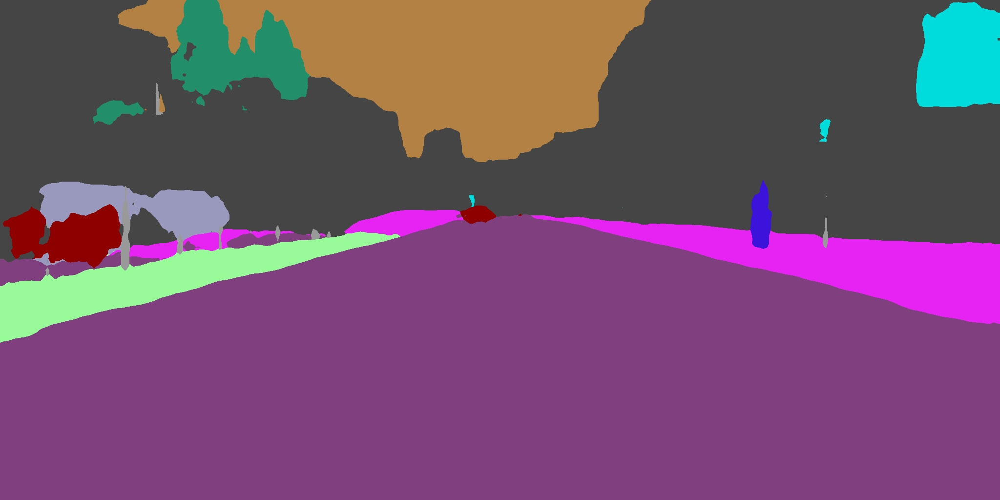
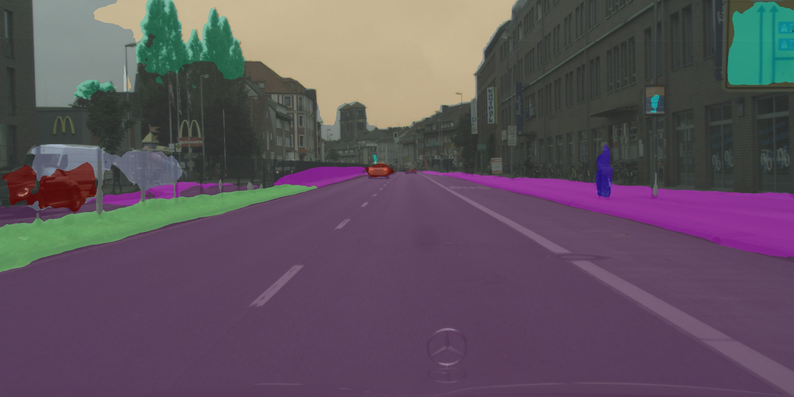

# ICNet
This subdirectory provides an implementation of [ICNet for Real-Time Semantic Segmentation on High-Resolution Images](https://arxiv.org/abs/1704.08545) by Hengshuang Zhao, and et. al. (ECCV'18). Our implementation of ICNet is based on the caffe protoxt `icnet_cityscapes_bnnomerge.prototxt` by the original author found [here](https://github.com/hszhao/ICNet/blob/master/evaluation/prototxt/icnet_cityscapes_bnnomerge.prototxt). We specifically emphasize readability/ease of understanding in our implementation.


### Reproducing performance on cityscapes dataset
---
1. We use the pretrained weights graciously provided by https://github.com/hellochick/ICNet-tensorflow. Follow their steps to download the cityscapes weights, placing them in the `weights` folder.
2. run inference: `python inference.py ./weights/cityscapes/icnet_cityscapes_trainval_90k_bnnomerge.npy ./example_images/cityscapes1.png`





### Training your own ICNet
---
In addition to inference, we provide a script to train ICNet from scratch. We have had great success using it internally on our semantic segmentation task(s). In this section, we'll provide a minimal working example on how to train on a custom dataset, using ade20k as an example. Note: the training procedure in `train.py` is from scratch (no pretrained ResNet backbone is used) and hence is not intended to reproduce results from the paper, but only to illustrate how one might train on their own task.

Download the cityscapes dataset:
```
wget http://data.csail.mit.edu/places/ADEchallenge/ADEChallengeData2016.zip
unzip ADEChallengeData2016.zip
```

Convert dataset into TFRecords via included script:
```
convert_ade20k_to_tfrecords.py ./ADEChallengeData2016 ./tfrecords
```

Train the network:
```
python train.py
```
