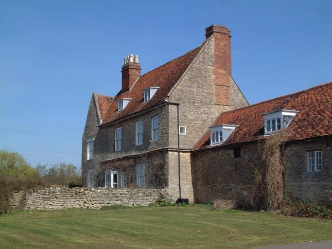

# PSPNet

### Reproducing performance on ade20k dataset
---

We provide two variants of PSPNet. The variant used in `infernce.py`, `PSPNet50`, is a tensorflow copy of the caffe prototxt provided in the original paper and hence can load the original (converted) weights and do inference. The weights and some of the inference utility code taken from https://github.com/Vladkryvoruchko/PSPNet-Keras-tensorflow.

1. First download the converted weights: [pspnet50_ade20k.h5](https://www.dropbox.com/s/0uxn14y26jcui4v/pspnet50_ade20k.h5?dl=1) and place in `weights` folder
2. run inference: `python inference.py ./weights/pspne50_ade20k.h5 ./images/ade20k_val_sample_image.jpg`




### Training your own PSPNet
---

We use the `PSPNet34` variant (trained from scratch) interally at KeyMe for our own semantic segmenttion task with great success. In this section, we'll provide a minimal working example on how to train on a custom dataset, using ade20k as an example. Note: the training procedure in `train.py` is from scratch (no pretrained ResNet backbone is used) and does not use `PSPNet50`, and hence is not intended to reproduce results from the paper, but only to illustrate how one might train on their own task.

Download the ade20k dataset:
```
wget http://data.csail.mit.edu/places/ADEchallenge/ADEChallengeData2016.zip
unzip ADEChallengeData2016.zip
```

Convert dataset into TFRecords via included script:
```
convert_ade20k_to_tfrecords.py ./ADEChallengeData2016 ./tfrecords
```

Train the network (there are 2000 images in the validation set, so we reccomend setting the `--num_samples_per_val` flag close to 2000 depending on chosen batch size):
```
python train.py --num_samples_per_val 1984
```
